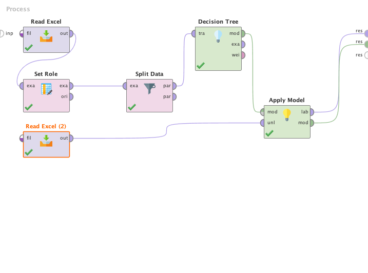

# Loan Assessment

In this analysis, I anlayze factors to assess potential customer for loan. By using four different models, I will predict either this applicant are suit to approve his/her loan application. This analysis can be used for any bank or institution that provide loan to clients. 

## Modelling

Training model

   

   

   

  

Testing model

   

   

   

  

## Evaluation

   

   

   

  

## Testing 

   

   

   

  
